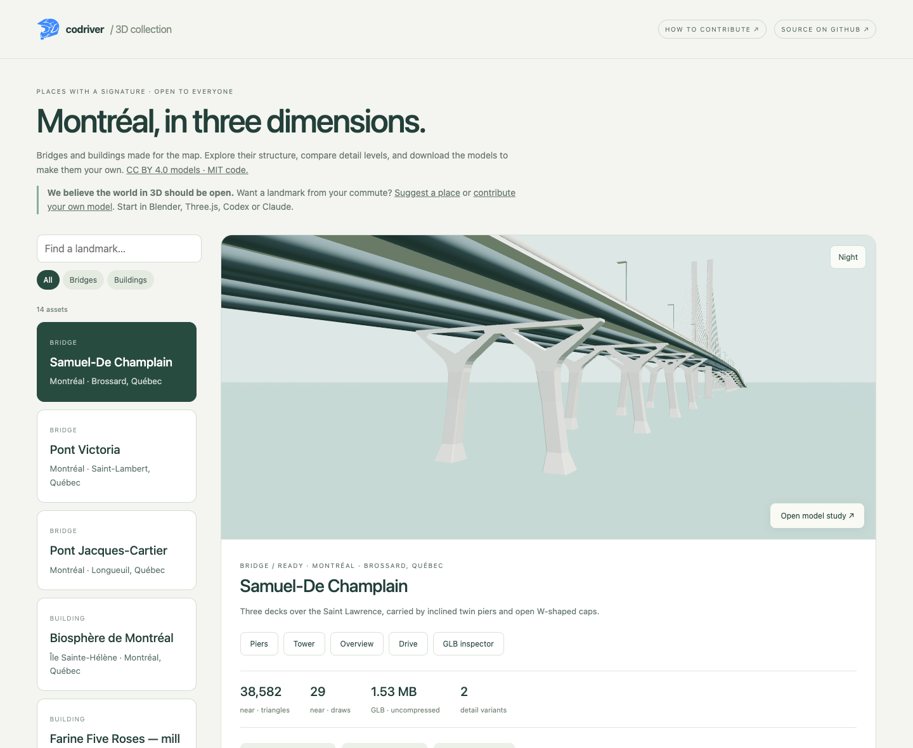
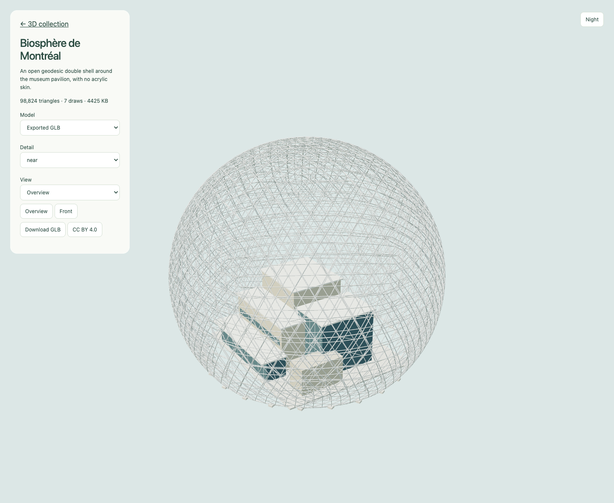

# Codriver 3D assets

Public source: [codriver-io/codriver-3d-assets](https://github.com/codriver-io/codriver-3d-assets).

An open collection of Montréal landmarks: 14 bridges and buildings, 36
self-contained GLB variants, and the editable Three.js generators behind them.

**[Explore the public library](https://codriver-3d-assets.pages.dev/)** ·
**[How to contribute](CONTRIBUTING.md)** · **[Licensing](LICENSES.md)**

The library is public, without accounts or passwords. Orbit each model, compare
near/far detail, switch between procedural and exported geometry, and download
the GLBs. Champlain also has its original pier, tower and driving views.

Included: Samuel-De Champlain, Victoria, Jacques-Cartier and Honoré-Mercier
bridges; Biosphère, Farine Five Roses, Orange Julep, Place Ville Marie and
L’Anneau, Habitat 67, Olympic Stadium and Montréal Tower, La Grande Roue,
Notre-Dame Basilica, Clock Tower, and Saint Joseph's Oratory.

## A look inside



*The public collection, showing Samuel-De Champlain’s pier study.*



*Biosphère de Montréal: inspect, compare detail levels and download the model.*

## Use a model

Download a GLB from the library and import it in Blender, Three.js or another
glTF 2.0 tool. The models use metres, +X east, +Y up and +Z south, with a local
geographic origin recorded in each JSON manifest. No external textures or
special geometry decoders are required. Near/far variants represent detail
levels. Mercier includes complete models and independently usable bridge
partitions; don't render the complete model and partitions together.

The original source paths are retained to make the models' dependency graph
easy to follow. `src/peregrine/landmarks/` contains the generators and their
local coordinate data. This is a standalone asset library; no Codriver account,
application server or map service is needed.

## Build and preview

Requires Node 22+ and pnpm 11.2.2.

```sh
pnpm install --frozen-lockfile
pnpm build
pnpm check
pnpm dev
```

Open http://localhost:4173. `dist/` is the static Cloudflare Pages output.

For browser validation, keep the local server running, then run
`pnpm exec playwright install chromium` once and `pnpm test:browser`.
The check covers every cataloged model, both geometry sources, detail/theme
controls, the Champlain pier view and desktop/mobile catalog layouts.

To edit and regenerate models:

```sh
pnpm models:build
pnpm build
pnpm check
```

Individual `build:*` scripts are listed in `package.json` and each model's
documentation. After an individual export, `pnpm build` attaches license
metadata and recalculates the measured file sizes in its manifest. Full
regeneration works from an empty `public/models/` directory.

## Licenses and credit

Code and builder skill: **MIT**. Models: **CC BY 4.0**, credited to the
creator(s) named in each manifest. The original collection credits Codriver /
9570-6198 Québec inc. Its OpenStreetMap source data retains **ODbL 1.0** and
contributor attribution. See [LICENSES.md](LICENSES.md) for a
ready-to-use attribution and the scope of each license.

## Contribute your own landmark

**We believe the world in 3D should be open.** Want to see a landmark on your commute?
[Propose it in a GitHub issue](https://github.com/codriver-io/codriver-3d-assets/issues/new?template=landmark.yml),
fork the repository and send a pull request. The [contribution guide](CONTRIBUTING.md)
covers editable Blender or procedural source, near/far exports, creator credit,
catalog registration, screenshots and validation. GitHub issue forms, the PR
checklist and automated checks help review each submission. No private tools,
accounts or deployment credentials are needed to contribute.

The MIT-licensed [builder skill](.agents/skills/build-3d-landmarks/SKILL.md)
works with **Codex** (`$build-3d-landmarks`) and **Claude Code**
(`/build-3d-landmarks`). Both load the same instructions and bridge/building
references through their native repository skill folders. See the guide for
other clients and checkouts without symlink support.

Assets use a local metric frame. [Cityscape and topography](docs/adr/0002-cityscape-and-topography.md)
have different host placement requirements; the standalone inspector does not
verify app integration. The [authoring decision](docs/adr/0001-open-landmark-pipeline.md)
and [submission checklist](docs/model-submission.md) document the handoff.

## Deploy

With Cloudflare Pages access configured locally:

```sh
pnpm deploy
```

This uses direct upload to the `codriver-3d-assets` Pages project. GitHub stores
the public source; publishing a source commit alone does not deploy Pages.
No credentials are stored in this repository.
