# Codriver 3D assets

Public source: [codriver-io/codriver-3d-assets](https://github.com/codriver-io/codriver-3d-assets).

**Open models. Endless worlds.** We’re building the world’s largest open-source 3D model
library for applications, maps and games. The collection starts with real landmarks
from Montréal and the rest of Québec, Paris, Toronto, San Francisco, Calgary and 5 more cities: 121 landmarks and four
reusable bridge components, 258 self-contained GLB variants, and editable Three.js generators. Anyone can explore,
reuse and help grow it.

**[Explore the public library](https://3d-assets.codriver.io/)** ·
**[How to contribute](CONTRIBUTING.md)** · **[Licensing](LICENSES.md)**

The library is public, without accounts or passwords. Orbit each model, compare
near/far detail, switch between procedural and exported geometry, and download
the GLBs. Champlain also has its original pier, tower and driving views.

Montréal: Samuel-De Champlain, Victoria, Jacques-Cartier and Honoré-Mercier
bridges; Biosphère, Farine Five Roses, Orange Julep, Place Ville Marie and
L’Anneau, Habitat 67, Olympic Stadium and Montréal Tower, La Grande Roue,
Notre-Dame Basilica, Clock Tower, and Saint Joseph's Oratory.

Paris: Tour Eiffel, Arc de Triomphe, Notre-Dame de Paris, Sacré-Cœur, Dôme des
Invalides, Palais du Louvre, Palais Garnier, Grand Palais, Petit Palais,
Musée d’Orsay, Panthéon, Hôtel de Ville, Conciergerie, Madeleine and Institut
de France; Pont Alexandre III, Bir-Hakeim, Pont Neuf, Pont d’Iéna and Pont
de la Concorde. The Louvre model includes the historic palace and glass pyramid; the Eiffel
model represents the architectural structure without its illumination show.

Toronto: CN Tower, Rogers Centre, Toronto City Hall, Old City Hall, Casa Loma,
Royal Ontario Museum, Art Gallery of Ontario, First Canadian Place,
Toronto-Dominion Centre, Scotia Plaza, Union Station, Ontario Legislative
Building, Scotiabank Arena, Fairmont Royal York, the Gooderham (Flatiron)
Building, St. Lawrence Market, Cinesphere, Sharp Centre for Design, the Prince
Edward Viaduct and the Humber Bay Arch Bridge. Build them with
`pnpm build:toronto-landmarks`; each folder under
`src/peregrine/landmarks/toronto/` holds one landmark's generator and mapped footprint.

San Francisco: Golden Gate Bridge, the Bay Bridge West and East spans, the Lefty
O'Doul Bridge, Transamerica Pyramid, Salesforce Tower, 555 California Street,
Columbus Tower, Ferry Building, SFMOMA, City Hall, Coit Tower, Sutro Tower, Grace
Cathedral, St. Mary's Cathedral, the Painted Ladies, Palace of Fine Arts,
Ghirardelli Square, Alcatraz, Oracle Park, Chase Center, Conservatory of Flowers,
de Young Museum, California Academy of Sciences and the Legion of Honor. Build them
with `pnpm build:san-francisco-landmarks`; the collection, frame and budgets are in
[docs/san-francisco-landmarks.md](docs/san-francisco-landmarks.md).

Calgary: the Calgary Tower, The Bow, Brookfield Place, Telus Sky, Suncor Energy
Centre, Bankers Hall, the Scotiabank Saddledome, the Central Library, Studio Bell,
Old City Hall, the Fairmont Palliser, the Canada Olympic Park ski jumps, and the
Peace, Centre Street and Reconciliation bridges. Build them with
`pnpm build:calgary-landmarks`; the collection and frame are in
[docs/calgary-landmarks.md](docs/calgary-landmarks.md).

Québec: the Château Frontenac, Hôtel du Parlement, Notre-Dame de Québec, Édifice
Marie-Guyart, Pavillon Pierre-Lassonde and Gare du Palais in Québec City; the Casino
de Montréal, Centre Bell, Marché Bonsecours, Hôtel de Ville, Marie-Reine-du-Monde and
Biodôme in Montréal; the Canadian Museum of History, the basilicas of Sainte-Anne-de-Beaupré
and Notre-Dame-du-Cap; and the Pierre-Laporte, Québec, Laviolette, Papineau-Leblanc and
Dubuc bridges. Build them with `pnpm build:quebec-landmarks`; the collection and frame
are in [docs/quebec-landmarks.md](docs/quebec-landmarks.md).

<!-- top-cities -->
Top cities: London: Tower Bridge, St Paul's Cathedral; Amsterdam: Amsterdam Centraal station; Madrid: Palacio Real de Madrid; Dallas: Reunion Tower, Margaret Hunt Hill Bridge; Washington: Washington Monument. Build them with `pnpm build:top-cities-landmarks`; the collection and frame are in [docs/top-cities-landmarks.md](docs/top-cities-landmarks.md).
<!-- /top-cities -->

## A look inside

Captured from the current exported GLBs (San Francisco on 1 October 2026). Select an image
to open the interactive model, compare detail levels or download it.

| Montréal, Paris, Toronto and San Francisco | |
| --- | --- |
| [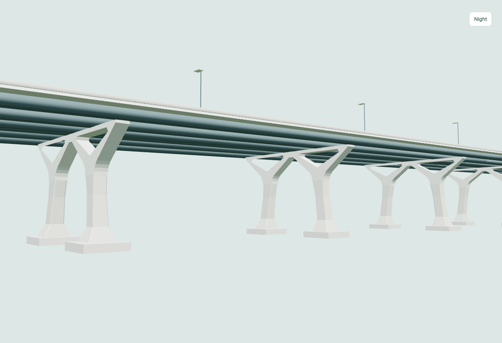](https://3d-assets.codriver.io/asset-preview.html?asset=samuel-de-champlain&view=piers)<br>Samuel-De Champlain — Montréal | [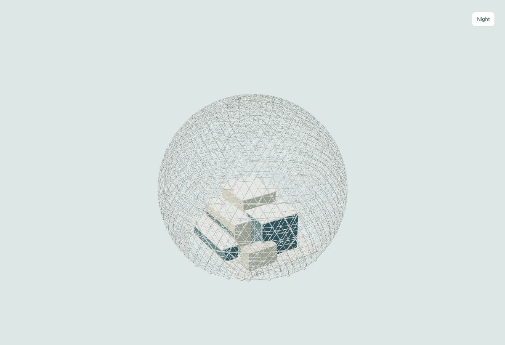](https://3d-assets.codriver.io/asset-preview.html?asset=biosphere-montreal&view=overview)<br>Biosphère — Montréal |
| [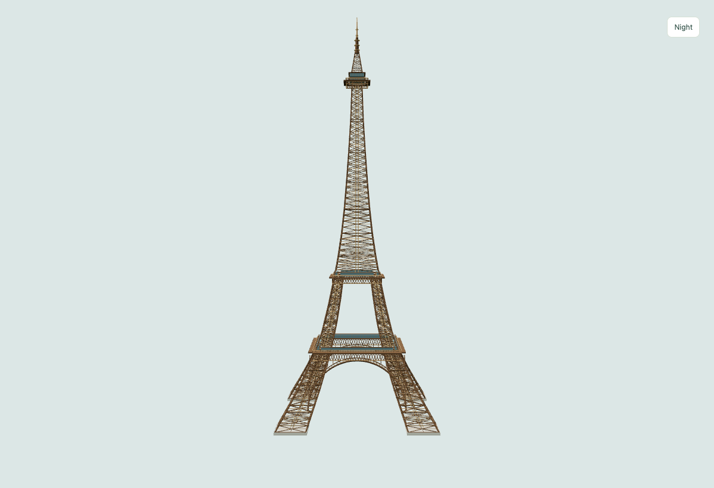](https://3d-assets.codriver.io/asset-preview.html?asset=paris-tour-eiffel&view=facade)<br>Tour Eiffel — Paris | [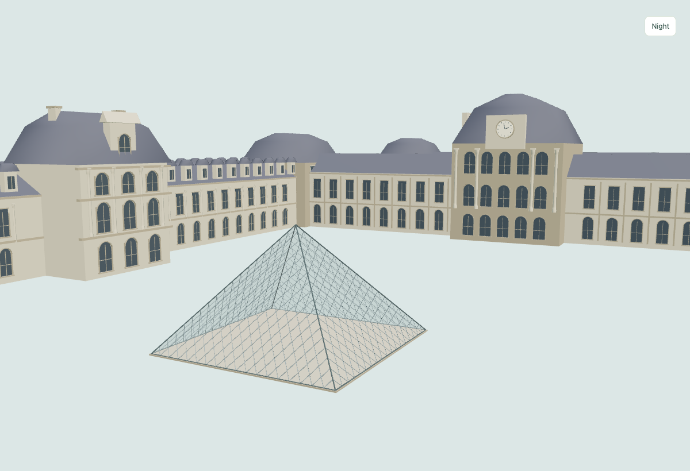](https://3d-assets.codriver.io/asset-preview.html?asset=paris-louvre&view=facade)<br>Palais du Louvre and pyramid — Paris |
| [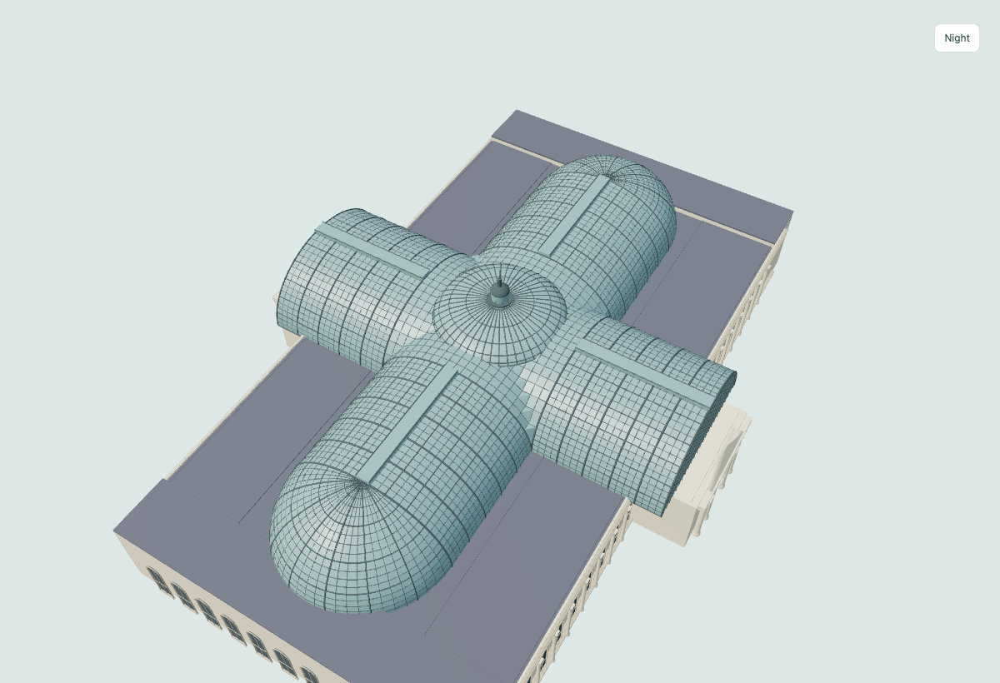](https://3d-assets.codriver.io/asset-preview.html?asset=paris-grand-palais&view=roof)<br>Grand Palais glass roof — Paris | [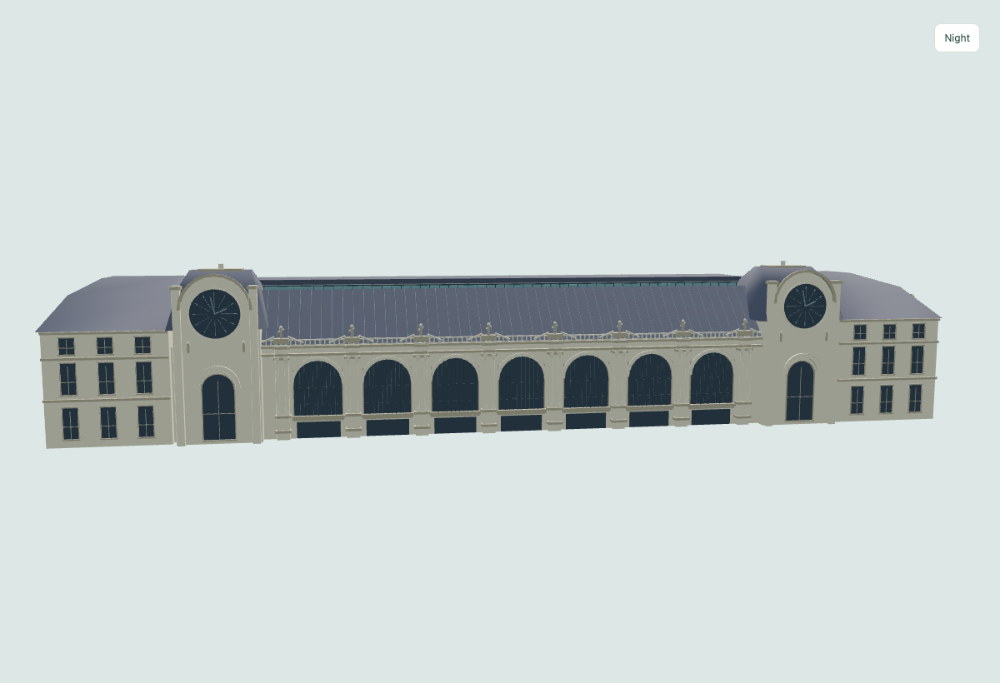](https://3d-assets.codriver.io/asset-preview.html?asset=paris-musee-orsay&view=facade)<br>Musée d’Orsay — Paris |
| [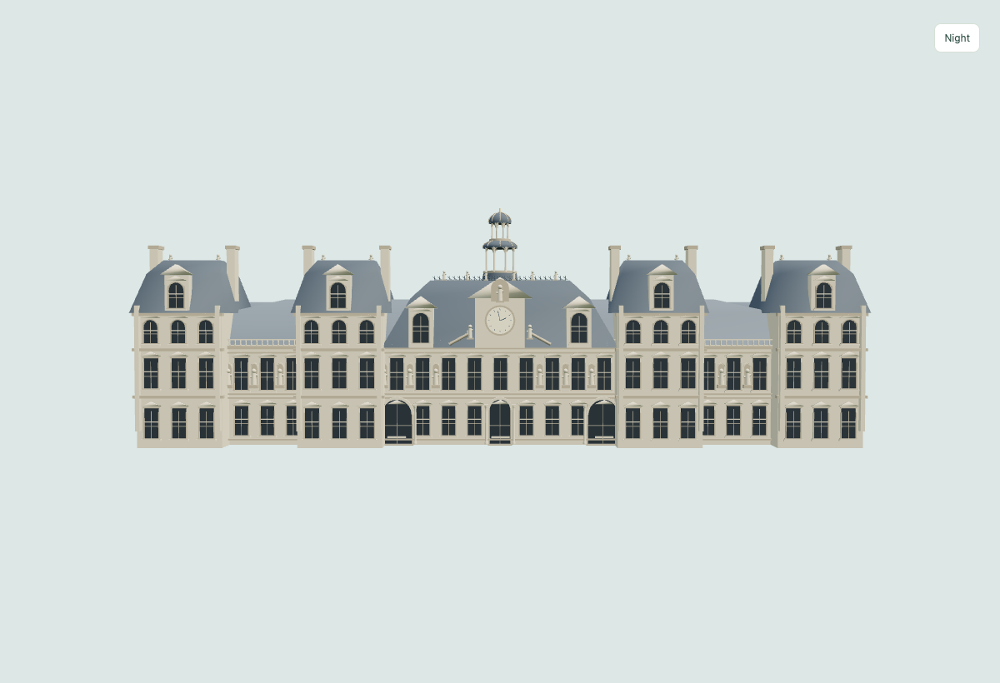](https://3d-assets.codriver.io/asset-preview.html?asset=paris-hotel-de-ville&view=facade)<br>Hôtel de Ville — Paris | [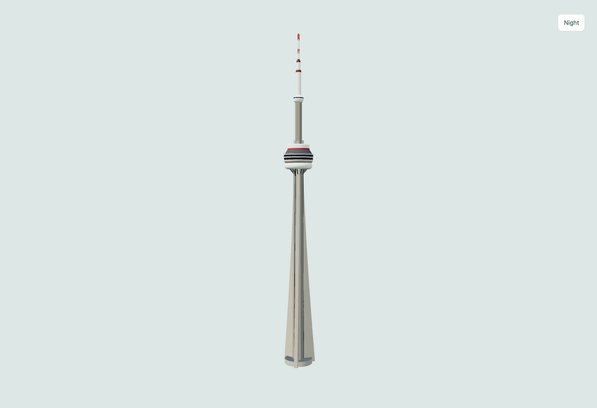](https://3d-assets.codriver.io/asset-preview.html?asset=cn-tower&view=overview)<br>CN Tower — Toronto |
| [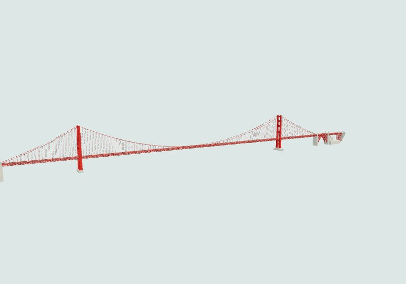](https://3d-assets.codriver.io/asset-preview.html?asset=golden-gate-bridge&view=overview)<br>Golden Gate Bridge — San Francisco | [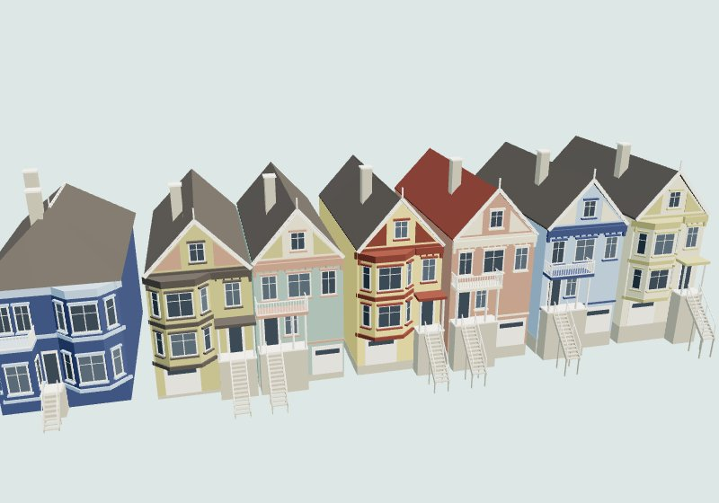](https://3d-assets.codriver.io/asset-preview.html?asset=painted-ladies&view=postcard)<br>Painted Ladies — San Francisco |
| [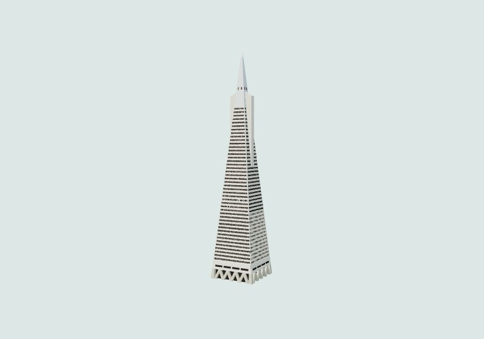](https://3d-assets.codriver.io/asset-preview.html?asset=transamerica-pyramid&view=overview)<br>Transamerica Pyramid — San Francisco | [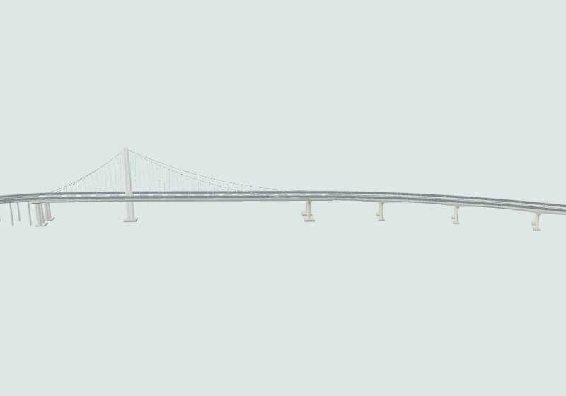](https://3d-assets.codriver.io/asset-preview.html?asset=bay-bridge-east-span&view=overview)<br>Bay Bridge East Span — San Francisco |

## Use a model

Download a GLB from the library and import it in Blender, Three.js or another
glTF 2.0 tool. The models use metres, +X east, +Y up and +Z south, with a local
geographic origin recorded in each JSON manifest. No external textures or
special geometry decoders are required. Near/far variants represent detail
levels. Mercier includes complete models and independently usable bridge
partitions; don't render the complete model and partitions together.

The original source paths are retained to make the models' dependency graph
easy to follow. `src/peregrine/landmarks/` contains the generators and their
local coordinate data. This is a standalone asset library; no Codriver account,
application server or map service is needed.

## Build and preview

Requires Node 22+ and pnpm 11.2.2.

```sh
pnpm install --frozen-lockfile
pnpm build
pnpm check
pnpm dev
```

Open http://localhost:4173. `dist/` is the static Cloudflare Pages output.

For browser validation, keep the local server running, then run
`pnpm exec playwright install chromium` once and `pnpm test:browser`.
The check covers every cataloged model, both geometry sources, detail/theme
controls, the Champlain pier view and desktop/mobile catalog layouts.

To edit and regenerate models:

```sh
pnpm models:build
pnpm build
pnpm check
```

Individual `build:*` scripts are listed in `package.json` and each model's
documentation. After an individual export, `pnpm build` attaches license
metadata and recalculates the measured file sizes in its manifest. Full
regeneration works from an empty `public/models/` directory.

## Licenses and credit

Code and builder skill: **MIT**. Models: **CC BY 4.0**, credited to the
creator(s) named in each manifest. The original collection credits Codriver /
9570-6198 Québec inc. Its OpenStreetMap source data retains **ODbL 1.0** and
contributor attribution. See [LICENSES.md](LICENSES.md) for a
ready-to-use attribution and the scope of each license.

Outside contributors also accept a separate [Contributor License Agreement](CONTRIBUTOR-LICENSE.md):
they retain ownership and grant Codriver permanent commercial and sublicensing rights
without individual attribution in its apps or products. Contributor recognition lives
in the 3D asset library. Public MIT/CC BY licenses and third-party/data obligations
remain separate; [explicit acceptance](docs/contribution-acceptance.md) is required.

## Contribute your own landmark

**We believe the world in 3D should be open.** Have a model or a place to add?
[Propose it in a GitHub issue](https://github.com/codriver-io/codriver-3d-assets/issues/new?template=landmark.yml),
fork the repository and send a pull request. The [contribution guide](CONTRIBUTING.md)
covers editable Blender or procedural source, near/far exports, creator credit,
catalog registration, screenshots and validation. GitHub issue forms, the PR
checklist and automated checks help review each submission. No private tools,
accounts or deployment credentials are needed to contribute.

The MIT-licensed [builder skill](.agents/skills/build-3d-landmarks/SKILL.md)
works with **Codex** (`$build-3d-landmarks`) and **Claude Code**
(`/build-3d-landmarks`). Both load the same instructions and bridge/building
references through their native repository skill folders. See the guide for
other clients and checkouts without symlink support.

Assets use a local metric frame. [Cityscape and topography](docs/adr/0002-cityscape-and-topography.md)
have different host placement requirements; the standalone inspector does not
verify app integration. The [authoring decision](docs/adr/0001-open-landmark-pipeline.md)
and [submission checklist](docs/model-submission.md) document the handoff.

## Deploy

The library is served at [3d-assets.codriver.io](https://3d-assets.codriver.io) from the
`codriver-3d-assets` Cloudflare Pages project (`codriver-3d-assets.pages.dev` keeps working).
Merging to `main` deploys it: once the *Validate library* workflow passes on `main`, the
*Deploy library* workflow builds `dist/` and uploads it. A maintainer can redeploy by running
that workflow by hand, or from a machine with Cloudflare access:

```sh
pnpm run deploy
```

The workflow reads the `CLOUDFLARE_API_TOKEN` secret, which pull-request runs never see; no
credential is stored in this repository.

## Analytics

The public site counts visits, opened models and model downloads with Codriver's self-hosted
[Plausible](https://plausible.io) instance (`stats.codriver.io`): no cookies and no personal
data. Only the production hosts load it, so local builds, previews and forks send nothing
(`scripts/analytics.mjs`, `src/analytics.js`).

### Paris street-level revision

The 20 Paris models now include more accurate primary proportions, architectural openings, differentiated roofs and bridge supports. [Review the changes and remaining approximations](docs/paris-street-level-refinement.md). The `/paris-refinement.html` comparison in a built library shows the original release beside this revision. Sculpture and lettering remain simplified; host app and terrain validation are separate.


### Five Paris landmarks, second pass

The Eiffel Tower, Louvre (now including its pyramid), Grand Palais, Musée d’Orsay and Hôtel de Ville have a second architectural refinement. [Changes, sources and measured costs](docs/paris-second-pass.md).

The gallery above shows the current exports, including the [Louvre window and Hôtel de Ville roof corrections](docs/paris-rendering-fixes.md).

### Jacques-Cartier bridge revision

The bridge now includes the roof-supporting island pavilion, four towers, deeper approach trusses and four separately downloadable island ramps. [Placement contract and mode evidence](docs/assets/jacques-cartier-placement.md). The public site also adds model thumbnails, city filters, direct detail-level downloads and a mobile model sheet.
