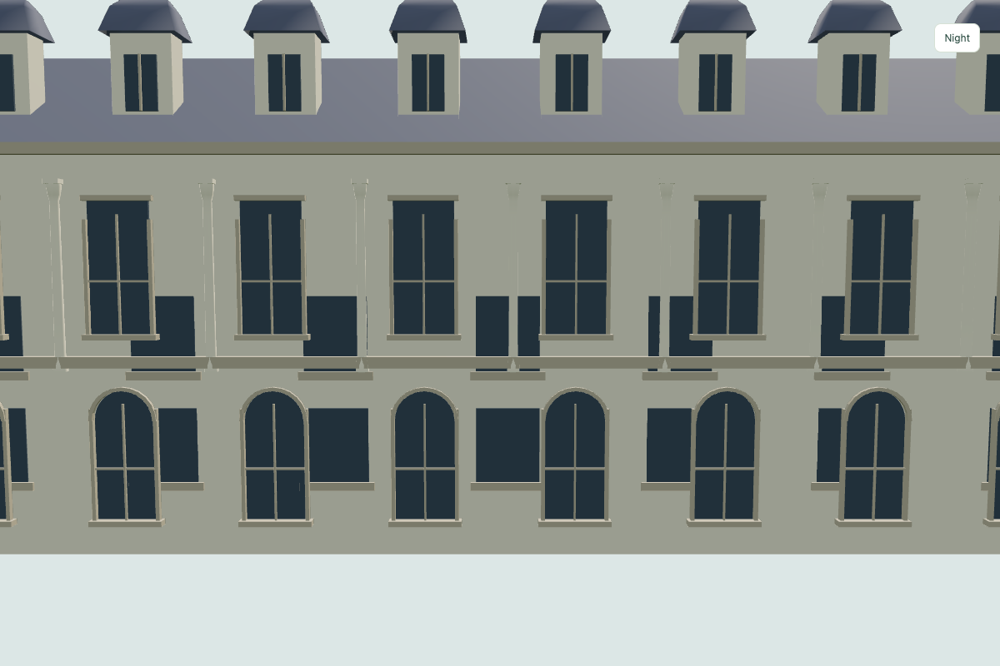
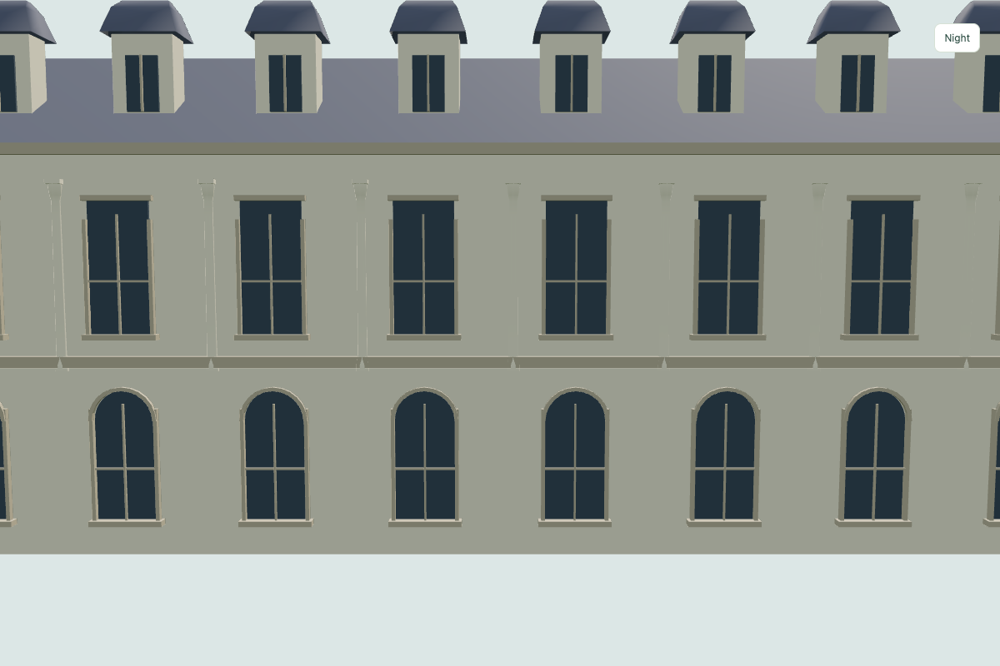
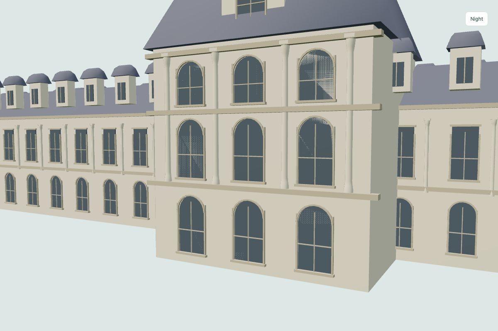
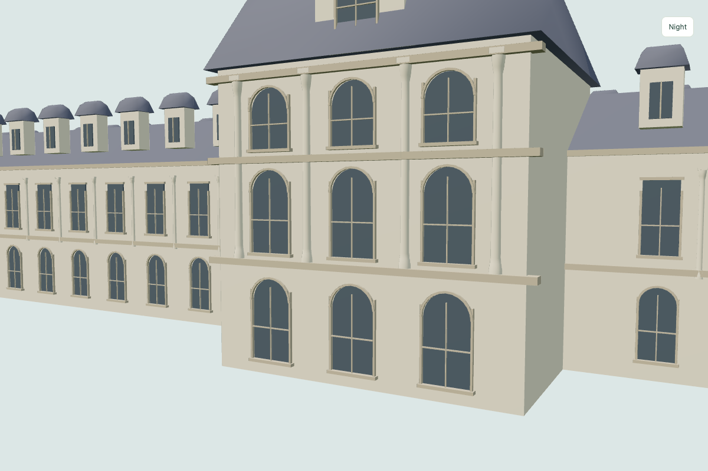
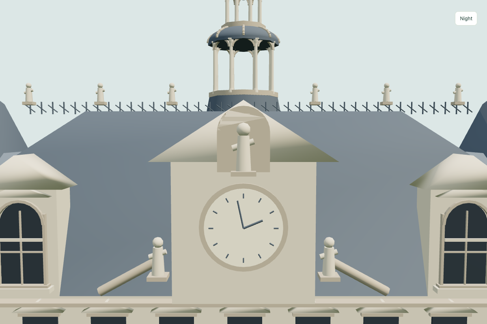
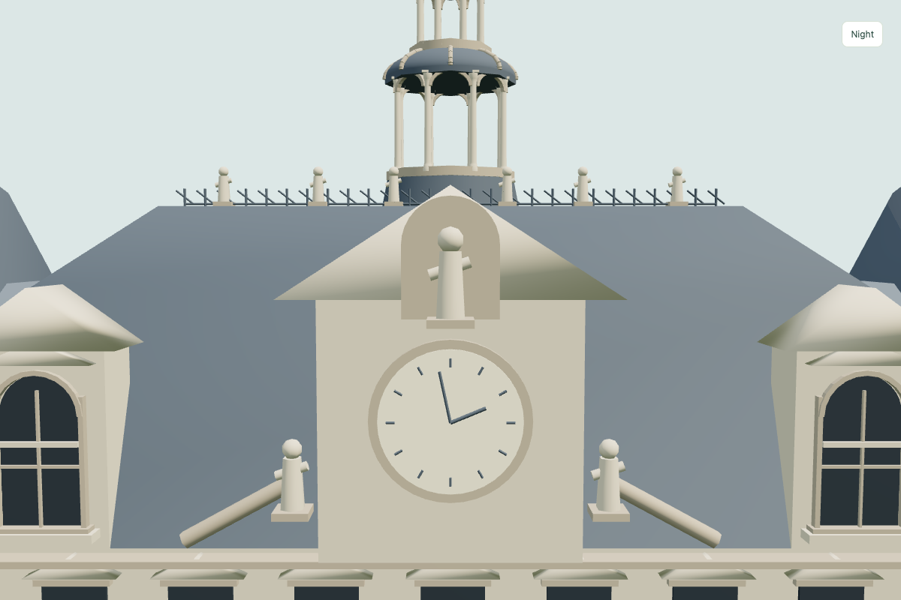
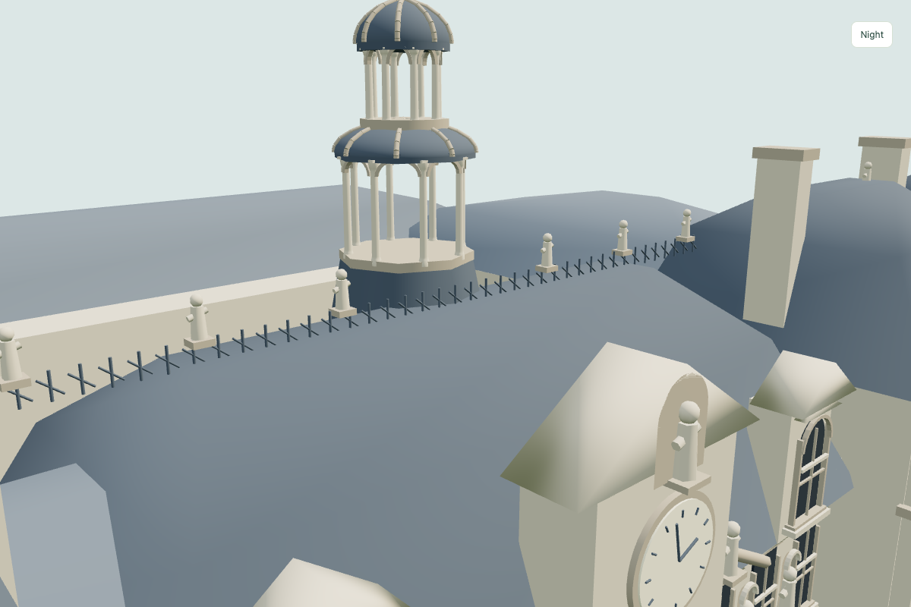
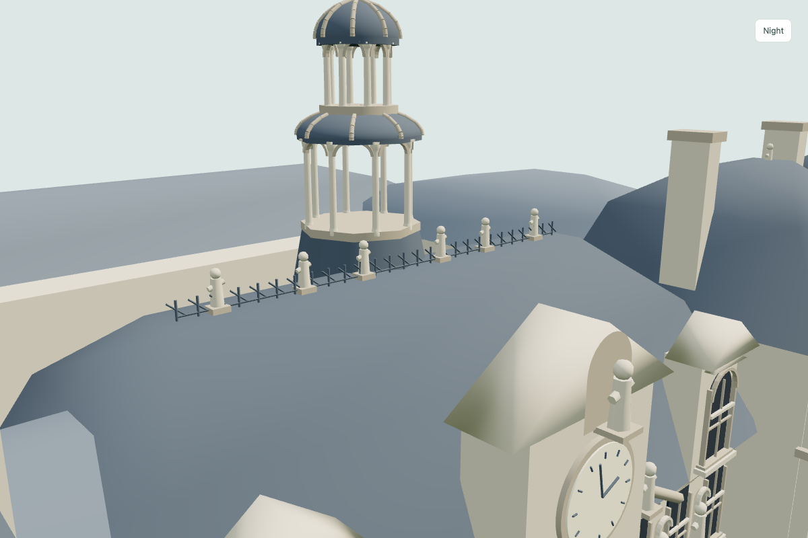

# Louvre and Hôtel de Ville rendering corrections

Follow-up to the second Paris pass, 2026-09-29.

The Louvre used both a legacy rectangular window grid and the newer framed bays on its long wings. Overlapping wing shells and an older Cour Carrée arcade also introduced redundant surfaces. Each long elevation now has one wall and one window grid, with bays omitted where a projecting pavilion owns the facade. Court window panes sit 20 cm ahead of their backing masonry, behind the projecting frames.

The Hôtel de Ville statue niche shared the clock pediment's front plane. The niche and statue now have separate depths. Ridge ironwork had followed the central mansard's eave width rather than its narrower crest; its full extent and six statues now fit on that crest, with statue plinths resting on the roof.

Four regression checks reproduced the original problems before the fixes. They cover the exterior inter-storey band, court pane-to-wall separation, statue niche separation and supported roof-ornament bounds, in near/far procedural source and exported GLBs. Exported roots retain their original rotation during these checks. Browser review uses close facade views and camera movement.

Cityscape and Full 3D world visual placement remain **not tested for this correction**; standalone inspection does not establish terrain integration.

## Matched close views

Near exported GLBs; identical cameras before and after.

### louvre-exterior

| Before | After |
| --- | --- |
|  |  |

### louvre-courtyard

| Before | After |
| --- | --- |
|  |  |

### hotel-niche

| Before | After |
| --- | --- |
|  |  |

### hotel-ridge

| Before | After |
| --- | --- |
|  |  |

Validation: public catalog, license and contribution checks passed, as did all 11 geometric regressions. Source/GLB, near/far and day/night browser checks passed for both changed models. The inspector and download links include the export version so changed GLBs bypass earlier browser cache entries.
